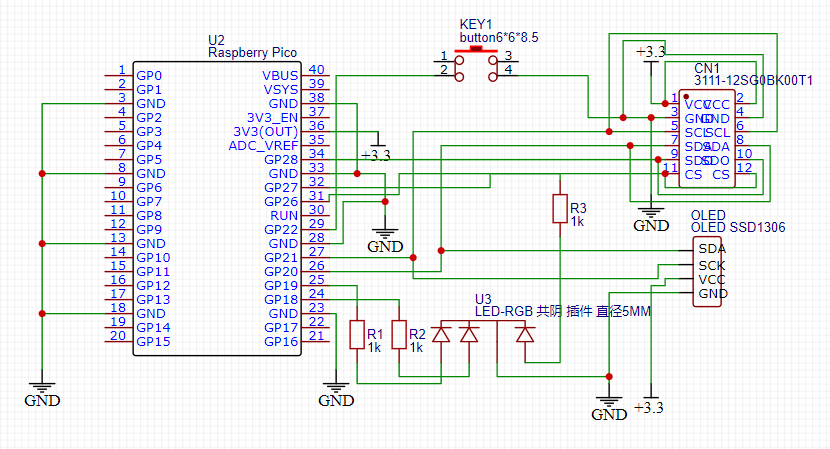

# MÓDULO DE PRESSÃO ATMOSFÉRICA

O módulo de pressão atmosférica faz parte do projeto de estação meteorológica no âmbito da disciplina de Laboratorio Experimental de Campus Inteligente (IE321K - 2S2022).

O sensor utilizado é o [BME680](https://br.mouser.com/datasheet/2/783/BST_BME680_DS001-1509608.pdf) que além da pressão atmosférica, realiza medição de outras grandezas como temperatura, umidade relativa do ar, altitude e qualidade do ar.

## Protótipo

Foi realizado um protótipo inicial para avaliar as medições do sensor e dinâmica de funcionamento do software.

Para o circuito foram utilizados os seguintes componentes:

* RaspberryPi Pico 
* Módulo sensor BME680
* 1 Tela (_Display_ OLED 128x32)
* 1 LED RGB
* 1 Botão (_Push button_)

**Funcionamento:** O LED RGB informa a cor verde indicando funcionamento normal do sistema. A cada leitura do sensor e pressionamento do botão, o LED pisca.
O botão serve para alternar a exibição na tela das 5 grandezas exibidas pelo sensor, sendo que inicialmente é exibido primeiro o valor de pressão atmosférica.
As medições ocorrem a cada 10 segundos. Caso ocorra algum erro com a leitura I2C do sensor, o LED vai alternar para vermelho, piscando a cada 5 segundos. Ao restabelecer a conexão I2C, retorna ao estado normal (verde).
